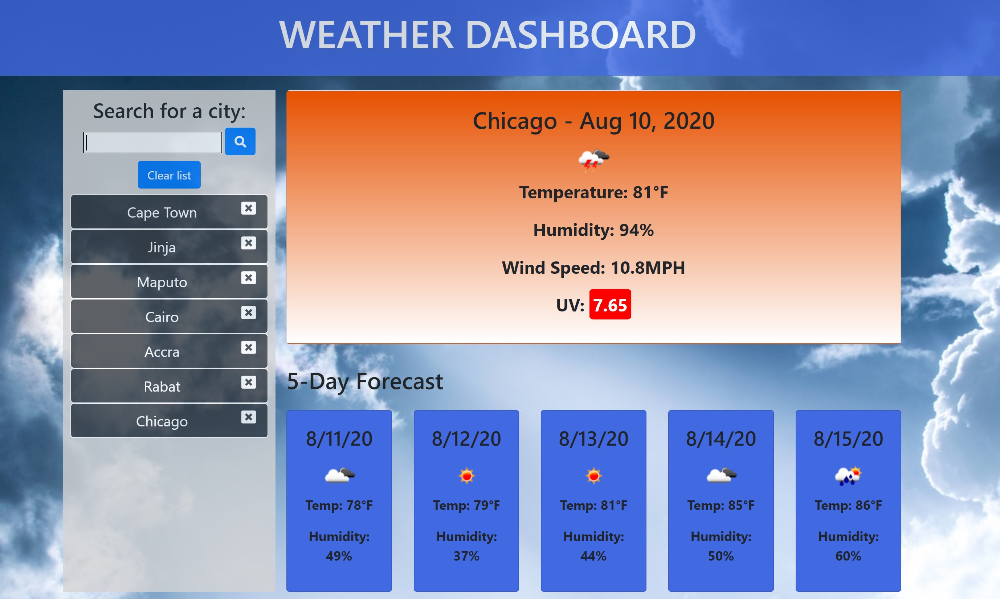

# WeatherDashboard

This app takes the user input of a city anywhere in the world and, using the OpenWeatherMap API, returns current weather plus a 5-day forecast. The current weather conditions displayed include city, date, weather icon, temperature in degrees Fahrenheit, humidity, wind speed, and UV index. The UV index is color-coded to indicate whether it is low, moderate, or high severity. The 5-day forecast includes date, weather icon, temperature, and humidity.

As the user searches for cities, their search history is rendered in buttons, allowing the user to easily revisit a city's weather conditions. This search history is stored in local storage. The rendered city buttons have a small 'delete' button in them, allowing the user to delete a city from the search history list and local storage. There is also a 'clear list' button allowing the user to clear all cities from the search history and from local storage.

There is a modal to respond to invalid searches, such as no text, numbers, or input that doesn't return a response. Testing also revealed that search input beginning with a comma would actually return a city response, so an if/else statement set in the search button event listener will respond to comma-initial input with the error modal as well.

Application URL: https://saramcguinn.github.io/WeatherDashboard/

Github repo: https://github.com/saramcguinn/WeatherDashboard

I am satisfied with the level of detail of my javascript. As far as I can tell, the application will handle most common input problems. I am not quite as pleased with my html or css, although they are both passable. The html makes extensive use of Bootstrap, which is div-heavy, and as a result I find it tough to read the final code. The css styling is also not exactly what I intended, as I struggled to override some built-in styles such as button focus. I'd like to practice more with Bootstrap-less designs, perhaps making use of flexbox.

I am happy with what I practiced and learned while building this application:
- Performing Ajax calls
- Working with response data in complex objects and arrays
- Ajax error responses
- Modals
- Practice with local storage
- Practice with moment.js
- Splice, toFixed, remove, stopPropogation methods